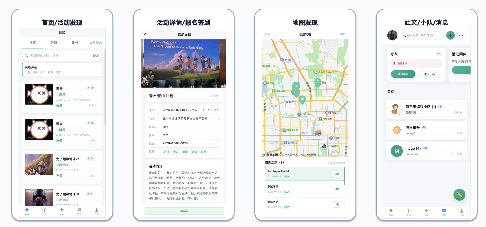
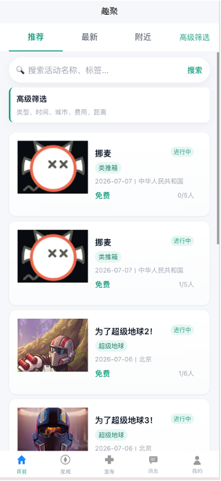
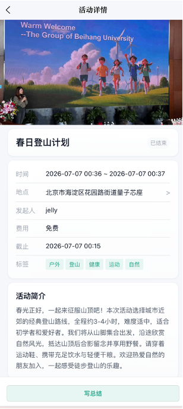
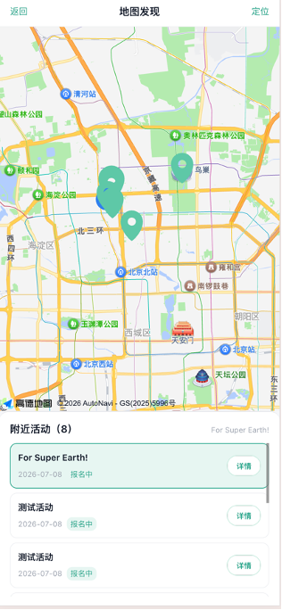
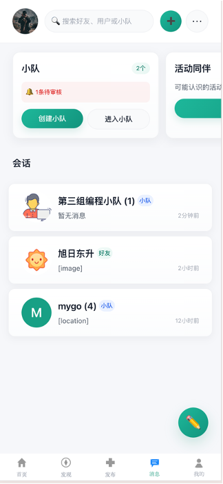

# MayoiStar · 迷星群聚

**Interest-based offline activity & social platform**  
以兴趣为纽带的线下活动社交平台

MayoiStar 帮助用户发现、发起并参与线下活动，同时通过好友、兴趣小队与即时通讯沉淀真实社交关系。仓库为全栈 monorepo：契约驱动 API、Spring Boot 后端、uni-app 用户端、React 管理端，以及基于 Kafka 的异步 AI 图片分类服务。

<p align="center">
  
</p>

<p align="center">
  <em>首页发现 · 活动详情 · 地图探索 · 社交小队与消息</em>
</p>

---

## 产品定位

| 角色 | 能力概要 |
| --- | --- |
| **个人用户** | 注册激活、资料与兴趣标签、发现/报名活动、好友与小队、IM |
| **商家用户** | 资质审核后的商家身份、面向活动运营的扩展资料 |
| **管理员** | 用户/商家/活动/小队治理、审核与封禁、举报处理 |

**核心用户路径**

1. 在首页信息流或地图上发现活动  
2. 查看详情并完成报名（满员进入候补）  
3. 现场签到参与活动  
4. 与同好加好友、加入小队并持续互动  

---

## 界面预览

| 首页 / 活动发现 | 活动详情 | 地图发现 | 社交 / 小队 / 消息 |
| :---: | :---: | :---: | :---: |
|  |  |  |  |

- **首页**：推荐 / 最新 / 附近 / 高级筛选，活动卡片信息流  
- **详情**：封面、时间地点、标签、简介与后续操作入口  
- **地图**：周边活动点位 + 附近列表  
- **消息**：小队入口、会话列表（好友 / 小队群聊）  

---

## 系统架构

```text
                    ┌─────────────────┐     ┌──────────────────┐
  uni-app Client ──►│                 │     │  React Admin Web │
  (H5 / App)        │  Spring Boot    │◄────│  (运营后台)       │
                    │  API :8080      │     └──────────────────┘
                    │  + STOMP WS     │
                    └────────┬────────┘
           ┌─────────────────┼─────────────────┐
           ▼                 ▼                 ▼
     PostgreSQL           Redis            RustFS (S3)
                              │
                         Kafka bus
                    request / response topics
                              │
              ┌───────────────┼───────────────┐
              ▼               ▼               ▼
         GPU Worker      GPU Worker      GPU Worker
         (CLIP ×N)       (CLIP ×N)       (CLIP ×N)
```

| 层次 | 技术选型 | 说明 |
| --- | --- | --- |
| API 契约 | **TypeSpec → OpenAPI** | 单一事实来源，CI 校验编译 |
| 后端 | **Java · Spring Boot** | 业务、安全、媒体、AI 编排 |
| 用户端 | **uni-app · Vue 3 · TypeScript** | 活动 / 社交 / 地图等主产品 |
| 管理端 | **React · Vite · TypeScript · Tailwind** | 用户 / 活动 / 小队运营 |
| 数据 | **PostgreSQL · Redis** | 业务数据 + 缓存 / 限流 / 任务状态 |
| 对象存储 | **RustFS（S3 兼容）** | 媒体文件 |
| 消息队列 | **Apache Kafka** | AI 分类异步解耦与扩展 |
| AI 边车 | **FastAPI · open_clip (ViT-B-32)** | 活动图片五类分类 |
| 实时 | **STOMP over WebSocket** | 聊天、社交与 AI 完成事件 |
| 质量 | **Vitest / JUnit · ESLint · Prettier · GitHub Actions** | 单测与 CI |

更细的部署与消息设计见：

- [部署指南](docs/deployment-guide.md)  
- [Kafka 架构](docs/kafka-architecture.md)  
- [媒体访问控制](docs/media-access-control.md)  
- [权限模型](docs/permission-model.md)  
- [API 约定](docs/api-convention.md)  

---

## 功能模块

### 1. 身份与账号

- 个人 / 商家注册，邮箱激活与密码找回  
- 资料管理（头像、唯一昵称、兴趣标签等）  
- 商家资质提交与后台审核  
- JWT 三角色：`personal` / `merchant` / `admin`

### 2. 活动生命周期

- 创建、草稿、模板化创建、AI 活动策划辅助  
- AI 内容安全审核 + 人工审核分流  
- 发现：信息流、搜索、高级筛选、**地图模式**  
- 报名、取消、候补递补与确认  
- 扫码签到（可结合位置校验）  
- 活动总结（CLIP 图片分类辅助整理）与用户评价  

### 3. 社交与即时通讯

- 好友申请、关注升级好友、备注与黑名单约束  
- 兴趣小队：公开/审核加入、角色权限、队内活动、相册、积分榜  
- 群聊：公告、@、投票、文件；好友/群文字、图片、位置消息  
- 已读回执、撤回、转发；WebSocket 实时事件  

### 4. 后台管理

- 管理员登录（预置账号，无自助注册）  
- 用户查询 / 封禁解封、商家审核  
- 活动下架与恢复、小队停用与恢复  
- 统一举报与治理入口  

### 5. 平台横切能力

- 统一 `APIResult` 与业务错误码（契约内枚举）  
- 媒体上传与签名访问、用途驱动的 ACL 生命周期  
- AI 限流；图片分类异步任务 + 缓存查询 + 完成推送  

---

## 仓库结构

```text
BUAA-SUMMER-2026/
├── api-spec/                 # TypeSpec API 契约与 OpenAPI 产物
├── backend/                  # Spring Boot 后端 + 本地 Docker Compose
├── frontend/
│   ├── mayoistar-client/     # uni-app 用户端
│   └── mayoistar-web/        # React 管理端
├── clip-service/             # CLIP 分类边车（HTTP / Kafka Consumer）
├── docs/                     # 架构与规范文档、README 截图
│   └── assets/
├── qa/                       # 种子脚本、API 测试集合
├── monitoring/               # Prometheus 等
└── .github/workflows/        # CI / 部署流水线
```

各子项目本地开发说明：

| 目录 | README |
| --- | --- |
| API 契约 | [`api-spec/README.md`](api-spec/README.md) |
| 后端 | [`backend/README.md`](backend/README.md) |
| 用户端 | [`frontend/mayoistar-client/README.md`](frontend/mayoistar-client/README.md) |
| 管理端 | [`frontend/mayoistar-web/README.md`](frontend/mayoistar-web/README.md) |
| CLIP 服务 | [`clip-service/README.md`](clip-service/README.md) |
| QA | [`qa/README.md`](qa/README.md) |

---

## 快速开始（概览）

完整步骤以各子目录 README 为准。典型本地链路：

```bash
# 以下命令均在仓库根目录下执行；长时间运行的服务请各开一个终端

# 1) 契约（需要时）
(cd api-spec && pnpm install && pnpm compile)

# 2) 基础设施 + 后端
(cd backend && docker compose --env-file .env -f docker-compose-local.yaml up -d postgres redis rustfs)
(cd backend && mvn spring-boot:run)

# 3) 用户端（默认可走 Mock；联调后端见 client README）
(cd frontend/mayoistar-client && pnpm install && pnpm dev:h5)

# 4) 管理端
(cd frontend/mayoistar-web && pnpm install && pnpm dev)
```

AI 图片分类需单独启动 `clip-service`（本地 HTTP 或生产 Kafka Consumer 模式），见 [`clip-service/README.md`](clip-service/README.md) 与 [`docs/deployment-guide.md`](docs/deployment-guide.md)。

---


## 文档索引

| 文档 | 内容 |
| --- | --- |
| [`docs/Requirements/`](docs/Requirements/) | 课程需求原文 |
| [`docs/api-convention.md`](docs/api-convention.md) | HTTP / 错误码 / 实时事件约定 |
| [`docs/permission-model.md`](docs/permission-model.md) | 角色与端点权限 |
| [`docs/media-access-control.md`](docs/media-access-control.md) | 签名 URL 与媒体生命周期 |
| [`docs/kafka-architecture.md`](docs/kafka-architecture.md) | AI 异步任务与拓扑 |
| [`docs/deployment-guide.md`](docs/deployment-guide.md) | 生产部署步骤 |

---

## 说明

本项目为北京航空航天大学软件工程综合实践（暑期）课程项目实现，产品中文名 **迷星群聚**，英文名 **MayoiStar**；需求文档中的产品名称为「趣聚」。

---

## License

课程实践项目代码，未经授权请勿用于商业用途。需求文档注明仅供暑期实践使用。
